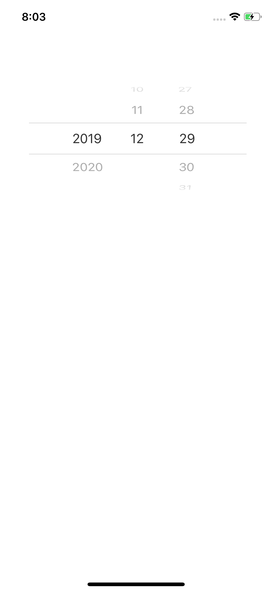

# EasyDatePicker

Custom system DatePicker, easily custom data and UI

## two UI problems

```
// remove separator line
func clearSeparatorLine() {
    for subView in self.subviews {
        if subView.frame.size.height < 1 {
            subView.isHidden = true
        }
    }
}
```

and

```
// add another view to highlight selected cell
lazy var showSelectedView: UIView = {
    let view = UIView()
    view.backgroundColor = UIColor.red
    view.alpha = 0.2
    view.translatesAutoresizingMaskIntoConstraints = false
    return view
}()
```

